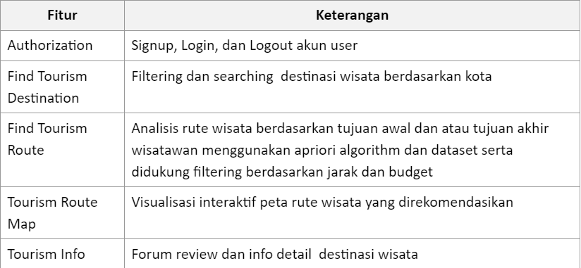
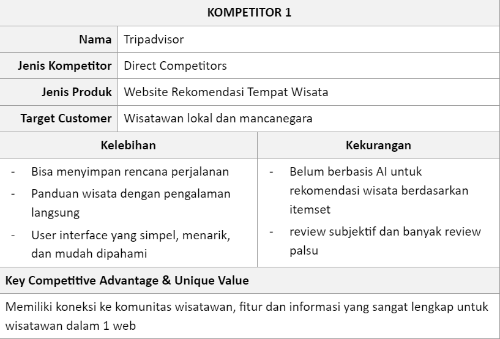
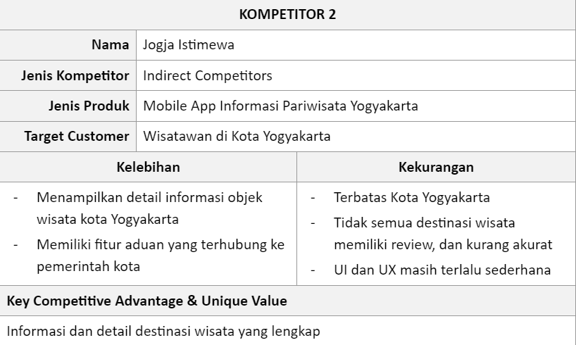
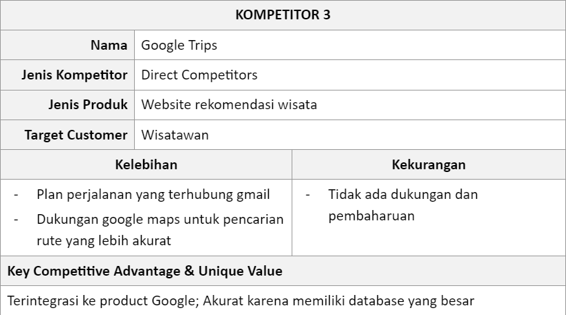

<h1 align="center">
  Rute.in-SeniorProject
</h1>

Bingung wisata kemana? Di Rute.in aja!
 

Kelompok ASMR
  Ketua Kelompok: Raisa Salsabil Yusriyya - 20/456376/TK/50506
  Anggota 1: Aditya Ramadhan - 20/460535/TK/51124
  Anggota 2: Senopati Ajeng Sinta Ayu Nadya Rizki - 20/460567/TK/51156
  Anggota 3: Maura Yufi Septania Putri-20/463607/TK/51599

  

<h3 align="center">Project Senior Project TI</h3>

<h4 align="center">Departemen Teknologi Elektro dan Teknologi Informasi, Fakultas Teknik, Universitas Gadjah Mada</h4>

  

#### Nama Produk: Rute.in

#### Jenis Produk: Web application

#### Latar Belakang

Indonesia memiliki banyak tempat wisata menarik, tetapi banyak wisatawan kesulitan menentukan rute wisata yang tepat dan efektif karena kurangnya informasi dan infrastruktur transportasi yang memadai. Pengembangan sistem AI untuk menentukan rute wisata yang tepat dan efisien dapat membantu para wisatawan dalam merencanakan perjalanan mereka dan meningkatkan pengembangan pariwisata di Indonesia.

#### Rumusan Permasalahan

1. Bagaimana cara meningkatkan aksesibilitas dan informasi untuk tempat wisata di berbagai daerah?
2. Bagaimana cara meningkatkan efisiensi dan efektivitas pengaturan rute wisata?
3. Bagaimana cara memberikan rekomendasi tempat wisata yang sesuai dengan minat wisatawan?
4. Bagaimana cara meminimalkan waktu perjalanan dan biaya perjalanan ke beberapa tempat wisata?

#### Ide Solusi

Pemanfaatan teknologi Artificial Intelligence (AI) dalam menentukan rute wisata di Indonesia dapat memberikan solusi bagi para wisatawan dalam merencanakan perjalanan mereka secara tepat dan efisien. Dalam hal ini, algoritma Apriori dapat digunakan sebagai metode untuk merekomendasikan tempat wisata yang sesuai dengan minat dan preferensi wisatawan berdasarkan data historis dari wisatawan sebelumnya. Algoritma Apriori dapat mengidentifikasi pola dalam data untuk menentukan rekomendasi tempat wisata yang sesuai dengan minat dan preferensi wisatawan.

#### Rancangan Fitur Solusi

#### Analisis Kompetitor

1. Kompetitor 1: Tripadvisor
    
2. Kompetitor 2: Jogja Istimewa
    
3. Kompetitor 3: Google Trips
    
